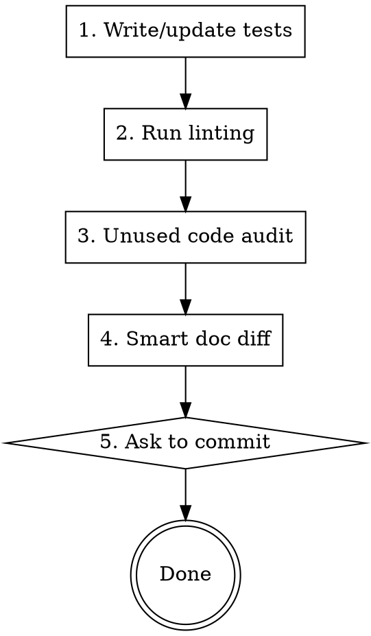

# Quality Checks

Post-implementation quality gate for the settings-profiles project. After completing any code change, suggest running this skill (ask first, don't auto-run).

## Process



## 1. Write/Update Tests

Scope: changed files + obvious gaps in nearby touched files.

1. Run `git diff --name-only` to identify changed source files under `src/`
2. For each changed file:
   - Check if a corresponding test file exists in `test/` (e.g. `src/util/FileSystem.ts` -> `test/util/FileSystem.test.ts`)
   - **No test file**: create one with tests for the public API of the changed file
   - **Test file exists**: review whether existing tests cover the changes; add tests for new/changed behavior
3. Scan files touched during the session for obvious untested public functions nearby — flag them but don't block on them
4. Run `npm run test` to verify all tests pass
5. If tests fail, fix them before proceeding

**Conventions**: Jest + ts-jest, jsdom environment, `src/*` path mapping via `moduleNameMapper` in `jest.config.js`. Follow existing patterns in `test/`.

## 2. Run Linting

1. Run `npm run lint` (release config)
2. If errors found, run `npm run lint-fix`
3. Report what was auto-fixed vs what needs manual attention
4. Run `npm run lint` again to confirm clean

## 3. Unused Code Audit

Check for unused or redundant code introduced or exposed by the changes:

1. **Unused exports**: for each export in changed files, grep for imports across the project. Flag exports with zero consumers (except `main.ts` plugin entry point exports consumed by Obsidian).
2. **Dead code**: look for commented-out code blocks, unreachable code after return/throw, unused variables not caught by lint.
3. **Redundant code**: duplicate implementations, copy-pasted blocks that could be consolidated.
4. Report findings. Offer to clean up if issues are found.

## 4. Smart Doc Diff

Compare `git diff` against documentation and flag **mismatches only**.

**CLAUDE.md** — check these sections:
- **Project Structure**: new/removed/renamed source files
- **Build & Dev Commands**: new or changed npm scripts in `package.json`
- **Architecture**: changed types/interfaces in `SettingsInterface.ts`, new storage patterns, changed data flow
- **Code Conventions**: only if conventions were deliberately changed

**README.md** — check these sections:
- **Commands**: new or removed Obsidian commands
- **Plugin Settings**: new or changed settings and their defaults
- **Profile Options**: new or changed profile categories
- **Features**: new or changed user-facing features
- **Status Bar**: changed status bar behavior

If no documentation-relevant changes were made, skip this phase and report "no doc updates needed."

If mismatches found, make the updates directly.

## 5. Ask to Commit

**IMPORTANT**: Do NOT offer to commit until the Smart Doc Diff step (step 4) is fully complete and any needed README.md / CLAUDE.md updates have been made.

Present a summary of all changes (implementation + tests + lint fixes + doc updates) and ask the user if they want to commit. If yes, create a commit with a descriptive message covering all changes.

## Output Format

After all phases, provide a summary:

```
## Quality Check Results

### Tests: [PASS/FAIL]
- Tests added/updated: [list]
- Total: X passed

### Linting: [PASS/FIXED/FAIL]
- [Issues found and resolution]

### Unused Code: [CLEAN/FOUND]
- [Any findings]

### Documentation: [UPDATED/NO CHANGES/NEEDS REVIEW]
- [Changes made or flagged]

### Ready to commit?
[Ask user]
```
